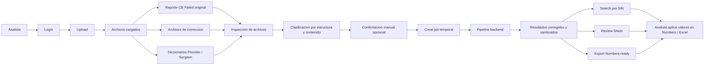
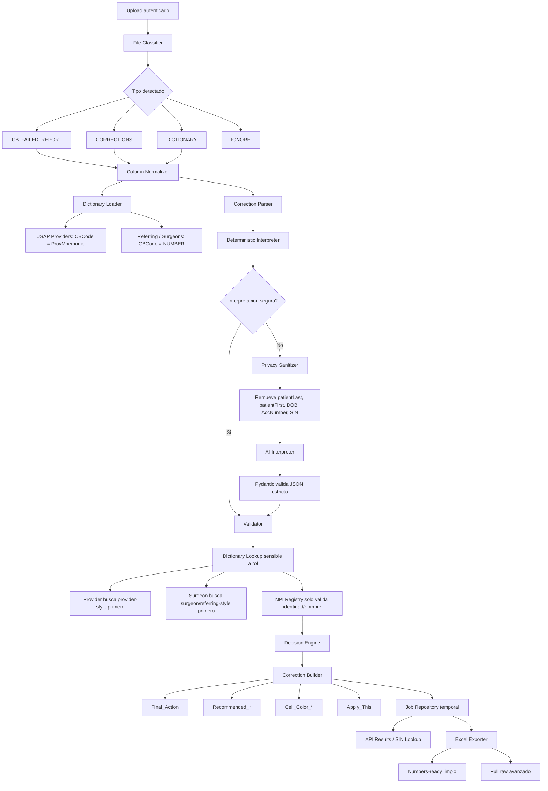
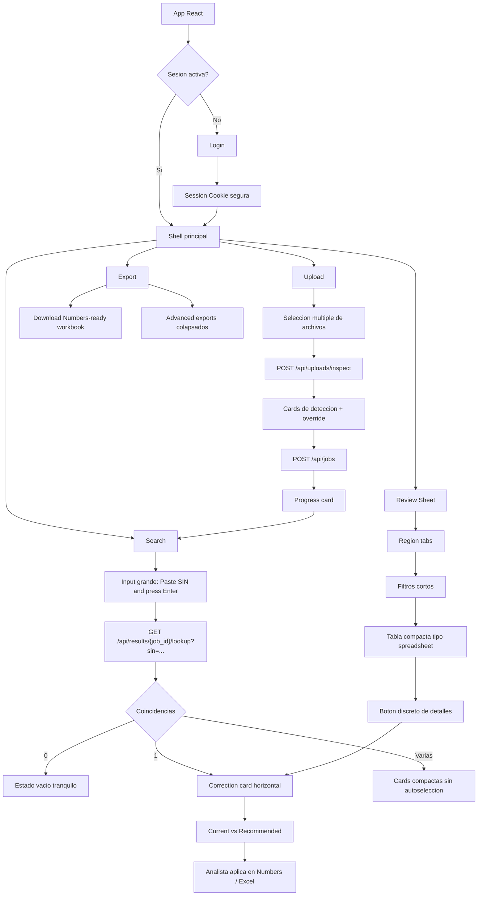
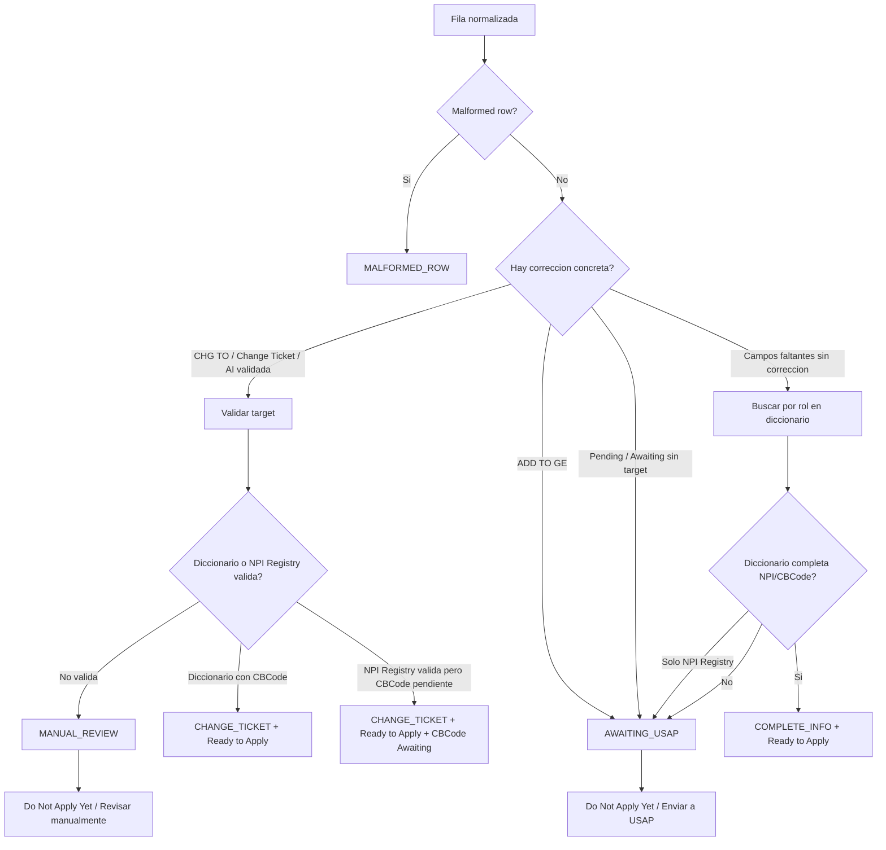

# CB Failed Assistant

CB Failed Assistant es una aplicación web para analistas que procesan reportes CB Failed y aplican correcciones manualmente en Numbers o Excel.

Su objetivo es reducir el tiempo de revisión y evitar errores operativos. El analista carga reportes, archivos de corrección y diccionarios de proveedores; la herramienta interpreta las correcciones, valida contra diccionarios, separa los casos listos de los pendientes y muestra exactamente qué valores deben aplicarse.

## Propósito

La herramienta ayuda a responder rápidamente:

- Qué acción debe tomarse en cada fila.
- Qué casos están listos para aplicar.
- Qué valores colocar en `Last - Title`, `First`, `NPI`, `CBCode`, `Comments` y `Source`.
- Qué casos deben ir a USAP o a revisión manual.
- Qué correcciones corresponden a `Provider` y cuáles a `Surgeon`.

El flujo principal está optimizado para buscar por `SIN`: el analista copia un SIN desde Numbers/Excel, lo pega en la aplicación y ve una comparación horizontal entre los valores actuales y los valores recomendados.

## Capacidades Principales

- Detección de archivos por estructura y contenido, no por nombre.
- Clasificación de reportes originales, archivos de corrección y diccionarios.
- Validación determinística contra diccionarios de providers y referring/surgeons.
- Diferenciación operativa entre `Provider` y `Surgeon`.
- Interpretación de correcciones como `Change Ticket`, `Complete Fields`, `Awaiting USAP`, `Manual Review` y `Remove from Ticket`.
- Búsqueda por `SIN` dentro del job activo.
- Vista `Review Sheet` para escanear filas por región, acción y estado.
- Guía de color por celda: rojo para cambios, verde para valores validados, amarillo para confirmación pendiente y gris para sin acción.
- Exportación de workbook listo para Numbers/Excel.
- Autenticación básica para uso operativo.
- Soporte de despliegue en Railway.

## Privacidad

La aplicación está diseñada para proteger PHI.

- Nunca se envían a AI estos campos: `patientLast`, `patientFirst`, `DOB`, `AccNumber` ni `SIN`.
- AI solo puede ayudar a interpretar comentarios ambiguos ya sanitizados.
- Las acciones finales y los valores recomendados se generan mediante reglas determinísticas y validación.
- Los archivos subidos y filas con PHI se conservan únicamente en almacenamiento temporal con TTL.
- Logs, métricas, feedback, auditoría y payloads ordinarios de UI deben mantenerse libres de PHI.
- La exportación completa puede incluir columnas originales de paciente solo para descarga operacional inmediata.

## Arquitectura

```text
backend/
  app/
    api/          Rutas FastAPI
    core/         Configuración, auth y seguridad
    schemas/      Modelos Pydantic
    services/     Procesamiento, validación, AI, exportación
    repositories/ Estado temporal de jobs, feedback y auditoría
    tests/        Pruebas backend

frontend/
  src/
    api/          Cliente HTTP tipado
    components/   Componentes compartidos
    pages/        Experiencia principal
    types/        Tipos TypeScript
```

Backend: FastAPI, pandas, openpyxl y Pydantic.

Frontend: React, Vite, TypeScript, Tailwind y React Query.

## Diagrama General Del Workflow



## Pipeline Interno Del Backend

El backend convierte archivos operativos en instrucciones concretas para el analista. La AI solo participa cuando una correccion en texto libre es ambigua y siempre recibe datos sanitizados.



## Flujo Interno Del Frontend

El frontend esta pensado como asistente de busqueda, no como dashboard pesado. El flujo principal es buscar un `SIN`, copiar o leer los valores recomendados y aplicarlos manualmente.



## Logica De Decision Simplificada



## Flujo De Uso

1. Iniciar sesión.
2. Subir reporte original, archivos de corrección y diccionarios.
3. Confirmar la detección de archivos en `Upload`.
4. Procesar el job.
5. Trabajar principalmente desde `Search`, buscando por SIN.
6. Revisar los valores actuales vs recomendados.
7. Aplicar manualmente las correcciones en Numbers/Excel.
8. Usar `Review Sheet` para escanear filas por región o filtro.
9. Descargar el workbook `Numbers-ready` si se necesita una salida consolidada.

## Ejecución Local

Crear el entorno e instalar dependencias:

```bash
python -m venv .venv
source .venv/bin/activate
pip install -r requirements.txt
npm install --prefix frontend
```

Crear configuración local:

```bash
cp .env.example .env
```

Variables mínimas recomendadas para desarrollo:

```env
APP_ENV=development
APP_PASSWORD=local-dev-password
SESSION_SECRET=change-me-locally
AI_ENABLED=false
```

Levantar la aplicación:

```bash
uvicorn backend.app.main:app --reload --host 0.0.0.0 --port 8000
```

Abrir:

```text
http://127.0.0.1:8000
```

## AI

AI es opcional y no reemplaza la validación.

Reglas:

- Primero corren reglas determinísticas y diccionarios.
- AI solo se usa para comentarios ambiguos.
- AI no recibe PHI ni SIN.
- AI no puede inventar `NPI`, `CBCode`, provider name ni valores finales.
- Cualquier valor extraído por AI debe validarse antes de aparecer en `Recommended_*`.

Variables relacionadas:

```env
OPENAI_API_KEY=
OPENAI_MODEL_PRIMARY=gpt-5.4-mini
OPENAI_MODEL_FALLBACK=gpt-5.5
AI_ENABLED=false
AI_CONFIDENCE_FALLBACK_THRESHOLD=0.70
AI_CONFIDENCE_AUTO_ACCEPT_THRESHOLD=0.90
MAX_AI_ROWS_PER_JOB=200
AI_TIMEOUT_SECONDS=20
AI_MAX_RETRIES=2
AI_BATCH_SIZE=10
AI_DAILY_COST_LIMIT_USD=5
```

## Despliegue En Railway

El repositorio incluye `Dockerfile` y `railway.json`.

Pasos:

1. Crear un servicio de Railway desde este repositorio.
2. Configurar variables usando `.env.example` como referencia.
3. Definir valores fuertes para `APP_PASSWORD` o `APP_ACCESS_TOKEN`.
4. Definir un `SESSION_SECRET` seguro.
5. Configurar `OPENAI_API_KEY` solo si `AI_ENABLED=true`.
6. Railway iniciará el servicio con:

```bash
uvicorn backend.app.main:app --host 0.0.0.0 --port $PORT
```

Healthcheck:

```text
/health
```

## Pruebas

Backend:

```bash
.venv/bin/pytest backend/tests
```

Frontend:

```bash
npm run build
```

## Notas Operativas

- Los diccionarios se detectan por columnas.
- `USAP Providers` usa `ProvMnemonic` como CBCode operativo.
- `USAP Referring Providers` y diccionarios tipo surgeon/referring usan `NUMBER` como CBCode operativo.
- `Provider` se resuelve preferentemente contra diccionarios provider-style.
- `Surgeon` se resuelve preferentemente contra diccionarios referring/surgeon-style.
- Si una corrección de USAP es `Change in the ticket` pero el CBCode aún no existe, la app puede marcarla como `Change Ticket` y `Ready to Apply`, manteniendo `CBCode = Awaiting for USAP confirmation`.
